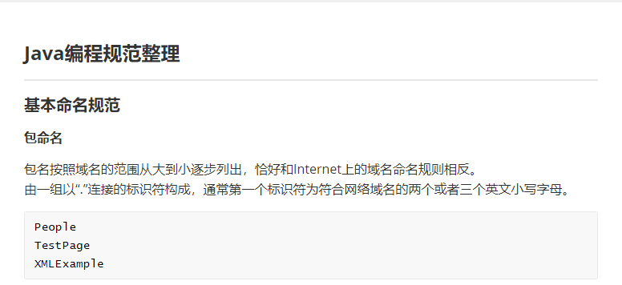
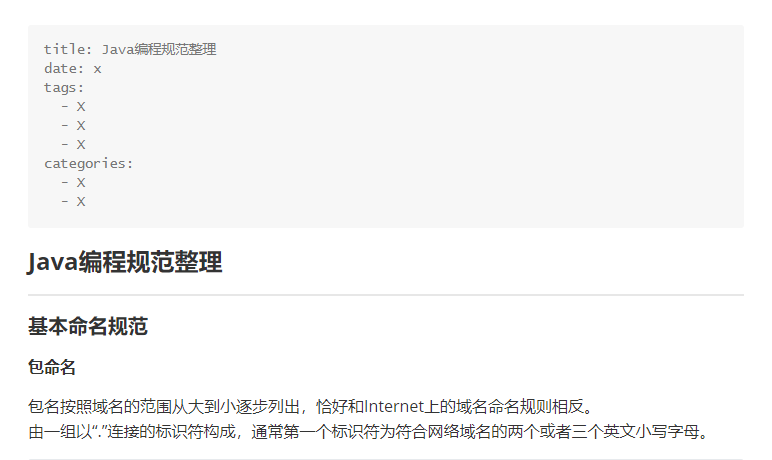

# ReadMe
- 给纯的markdown file添加hexo的信息,  方便pages的发布,  计划版本有cli和qt桌面版, 目前只完成了cli版本
- 使用方法: 
  - cli版本之中, 在`writeInfo4FileList`函数之中添加自己想要修改文档所在的目录即可, 添加的信息分别为`title`, `date`, `tags`,`categories`, 默认有2个category和3个tag, `title`信息自动加入, date信息可以获取创建时间, 此处暂时未加入, `tags`和`categories`信息需要生成模板之后手动添加. 

- 使用效果：

  使用前无hexo相关信息

  

  使用后添加了hexo相关信息

  